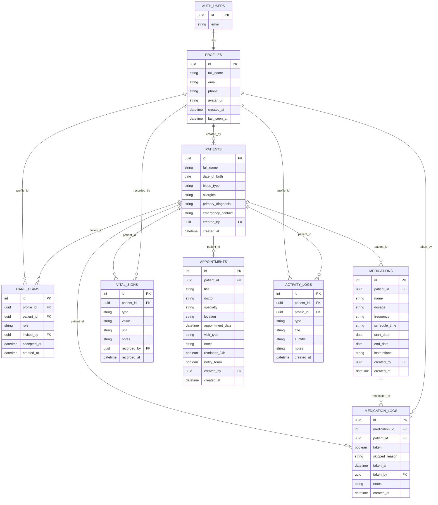

# Donna Amparo

> Cuidado familiar inteligente — acompanhe a saude de quem voce ama.

Donna Amparo e um aplicativo mobile e web desenvolvido em Flutter, voltado para familias que cuidam de pessoas idosas ou que precisam de acompanhamento continuo de saude. Com uma interface calorosa e intuitiva, centraliza medicamentos, consultas, hidratacao e comunicacao familiar em um so lugar.

---

## Funcionalidades

- **Inicio** — Visao geral do dia: proximo medicamento, progresso de hidratacao, proxima consulta e pendencias da familia
- **Medicamentos** — Lista de doses organizada por periodo (Manha / Tarde / Noite) com confirmacao interativa e barra de progresso diaria
- **Consultas** — Agenda medica com proximas consultas em destaque e historico completo com anotacoes medicas
- **Calendario** — Visao mensal agregando consultas, horarios de medicamentos e outros compromissos
- **Alertas** — Pendencias e itens resolvidos com filtros por categoria (Medicamentos, Consultas, Vitais, Hidratacao, Familia)
- **Perfil** (menu superior) — Dados do cuidador, circulo familiar, notificacoes, privacidade e preferencias de sistema (tema claro / escuro)

---

## Tecnologias

- [Flutter](https://flutter.dev/) — Framework multiplataforma (Android, iOS, Web, Desktop)
- [Dart](https://dart.dev/) — Linguagem de programacao
- [Google Fonts](https://pub.dev/packages/google_fonts) — Tipografia Inter
- [flutter_launcher_icons](https://pub.dev/packages/flutter_launcher_icons) — Icones do app para todas as plataformas
- Material Design 3

---

## Como rodar localmente

**Pre-requisitos:** Flutter SDK instalado ([flutter.dev/install](https://flutter.dev/install))

```bash
# Clonar o repositorio
git clone https://github.com/LuizErler/donna-amparo.git
cd donna-amparo

# Instalar dependencias
flutter pub get

# Rodar no browser
flutter run -d chrome

# Rodar no emulador Android
flutter run -d emulator-5554

# Build web para producao
flutter build web --base-href /donna-amparo/
```

---

## Estrutura do projeto

```
lib/
├── core/
│   └── theme/
│       └── app_theme.dart        # Tema global (claro e escuro)
└── features/
    ├── home/
    │   └── home_page.dart        # Tela inicial
    ├── medicamentos/
    │   └── medicamentos_page.dart # Gestao de doses diarias
    ├── consultas/
    │   └── consultas_page.dart   # Agenda medica
    ├── familia/
    │   └── familia_page.dart     # Circulo familiar
    ├── alertas/
    │   └── alertas_page.dart     # Notificacoes e pendencias
    └── configuracoes/
        └── configuracoes_page.dart # Perfil e sistema
```

---

## Identidade Visual

| Token | Valor | Uso |
|---|---|---|
| `primary` | `#C1622A` | Cor principal (terracota) |
| `background` | `#F5EDE3` | Fundo geral (bege creme) |
| `cardNormal` | `#FAF0E6` | Cards e paineis |
| `textPrimary` | `#2D1B0E` | Titulos e textos principais |
| Fonte | **Inter** (Google Fonts) | Toda a tipografia |

O app suporta **modo claro** e **modo escuro** com paleta adaptada, acessivel nas configuracoes do perfil.

---

## Diagrama Entidade-Relacionamento




## Licenca

MIT © 2026 Donna Amparo
