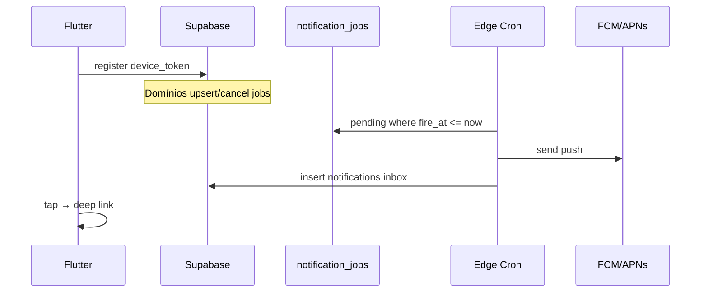

# Push & Notificações — Plataforma transversal (MVP)

Issue de tracking (Epic): [#118 — Push e Notificações](https://github.com/LuizErler/donna-amparo/issues/118)
Epic pai: [#65 — Epic Transversal](https://github.com/LuizErler/donna-amparo/issues/65)

## Objetivo

Infraestrutura **única** de notificações (push + inbox in-app) reutilizada por Medicamentos, Consultas/Exames, Hidratação e Família. Domínios **enfileiram jobs**; a plataforma **entrega**.

## Princípio

```
Epic Transversal — Push & Notificações
  ├── tokens, permissões, FCM, cron, inbox, preferências
  └── plug-ins (configurar depois):
        Medicamentos │ Consultas │ Hidratação │ Família
```

Nenhum epic de produto implementa FCM diretamente.

## Modelo de dados (proposta)

| Tabela | Função |
|--------|--------|
| `device_tokens` | FCM token por `profile_id` + platform |
| `notification_preferences` | Toggles por categoria (fase 4) |
| `notification_jobs` | Fila: `fire_at`, `type`, `payload`, `status` |
| `notifications` | Inbox in-app (RLS já referenciada em `001`) |

## Catálogo de tipos (`notification_jobs.type`)

| Tipo | Origem | Gatilho (configurável depois) |
|------|--------|--------------------------------|
| `appointment_reminder` | Consultas | `appointment_date - offset` |
| `appointment_team` | Consultas | `team_notify_offsets_minutes` |
| `medication_due` | Medicamentos | `isDueNow` / horário agendado |
| `medication_overdue` | Medicamentos | dose persistente atrasada |
| `hydration_attention` | Hidratação | `needsAttention` (2h) |
| `family_*` | Família | convites / eventos (fase posterior) |

## Arquitetura



**Stack acordada (ADR):** FCM + Supabase Edge Functions (cron worker) + Flutter (`firebase_messaging`).

## Fases

### Fase 0 — Planejamento
- [x] Epic + issues filhas no GitHub ([#118](https://github.com/LuizErler/donna-amparo/issues/118))
- [x] Este documento ([#119](https://github.com/LuizErler/donna-amparo/issues/119))
- [ ] Alinhar #101 e #109 como plug-ins

### Fase 1 — Plataforma (sem regras de negócio)
- [ ] [#120](https://github.com/LuizErler/donna-amparo/issues/120) Spike FCM + permissões iOS/Android
- [ ] [#121](https://github.com/LuizErler/donna-amparo/issues/121) Migration `device_tokens`, `notification_jobs`
- [ ] [#122](https://github.com/LuizErler/donna-amparo/issues/122) Edge Functions: `send-push`, `process-notification-jobs`
- [ ] [#123](https://github.com/LuizErler/donna-amparo/issues/123) Flutter: registro de token, handlers, deep link mínimo
- [ ] Push de teste (“ping”) no device

### Fase 2 — Primeiro plug-in
- [ ] **#101** — jobs de consulta a partir de offsets existentes (migration 009)
- [ ] Cancelar/reagendar jobs ao editar/excluir consulta

### Fase 3 — Demais origens
- [ ] **#109** — hidratação
- [ ] [#125](https://github.com/LuizErler/donna-amparo/issues/125) Medicamentos (dose due/overdue)
- [ ] [#124](https://github.com/LuizErler/donna-amparo/issues/124) Alertas in-app unificados com mesma fonte dos jobs

### Fase 4 — Produto
- [ ] [#126](https://github.com/LuizErler/donna-amparo/issues/126) Configurações → Notificações (substituir stub)
- [ ] Preferências por categoria, quiet hours
- [ ] #110 activity_logs, #111 relatório (opcional digest push)

## Configuração deferida (produto)

- Antecedência de medicamento (no horário vs 15 min antes vs só atraso)
- Repetição de hidratação enquanto pendente
- Quem da família recebe cada tipo
- Quiet hours / Madrugada (00:00)
- Copy final (Sr./Sra., nome do paciente)

## Issues relacionadas

| Issue | Papel |
|-------|--------|
| #101 | Plug-in consultas (fase 2) |
| #109 | Plug-in hidratação (fase 3) |
| #64 | Epic Alertas (inbox UI) |
| #65 | Epic Transversal (pai) |

## Ordem no roadmap global

1. Merge #117 + alertas **in-app** reais (validar regras sem push)
2. **Fase 1** deste plano (plataforma)
3. **#101** (consultas — offsets já no DB)
4. **#109** + medicamentos
5. Preferências e polish
